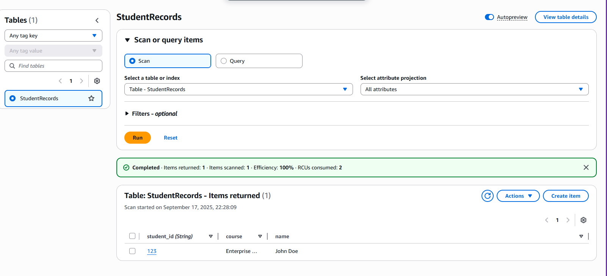
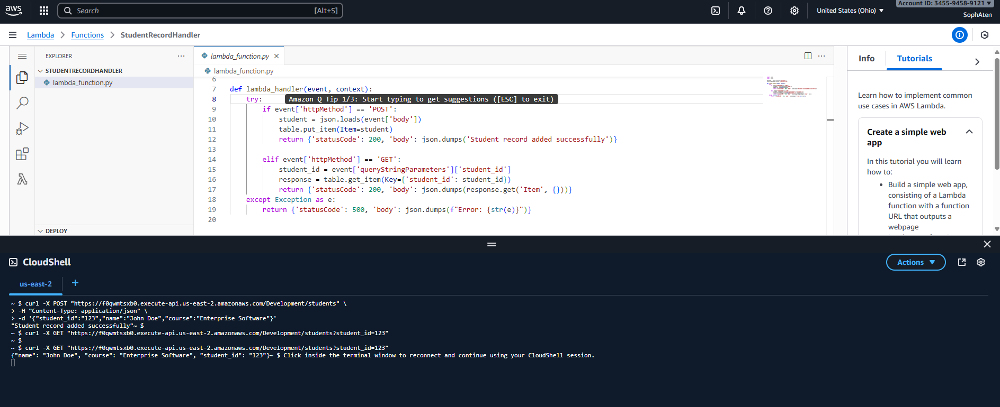

# Serverless-Web-Application-
---

## Screenshots

-   
-   

---

## Project Structure

- **DynamoDB Table** – `StudentRecords` (Primary Key: `student_id` as String)  
- **Lambda Function** – `StudentRecordHandler`  
  - Handles `POST /students` to create a student record  
  - Handles `GET /students` to fetch a student record  
- **API Gateway** – `/students` resource integrated with Lambda via **Lambda Proxy Integration**  

---

## Testing
  ### Create a Student (POST)
    curl -X POST "https://<your-invoke-url>/Development/students" \
    -H "Content-Type: application/json" \
    -d '{"student_id":"123","name":"Soph Aten","course":"Enterprise Software"}'
  ### Retreieve a Student (GET)
    curl -X GET "https://<your-invoke-url>/Development/students?student_id=123"

--- 

## Reflection

I encountered many challenges while making this severless web application. One of the main difficulties I encountered was connecting all the components together correctly. For example, my API requests weren't working correctly because I didn't realize that Lambda Proxy Integration was an option for requests in the API Gateway and I had to enable that feature in order for it to connect correctly with the lambda function. Another error that I came across was AWS permissions, my lambda function was not interacting correctly with my DynamoDB table, which resulted in AcessDeniedException errors. I had to learn how to give the function permissions using IAM in order to fix this problem. 

Overall the assignment was straightforward, but I ran into many issues when trying to make sure the serverless architecture between the DynamoDB table, the lambda function, and the API gateway was connecting correctly and worked together seamlessly. I learned a lot about how serverless applications work end-to-end and gained knowledge with creating lambda functions, designing API gateway endpoints, and performing operations on DynamoDB. I also learned how to debug in AWS by understanding error messages and figuring out how to fix them. I learned that it's important to make sure all of the structures in the architecture communicate correctly when building a serverless application. 

